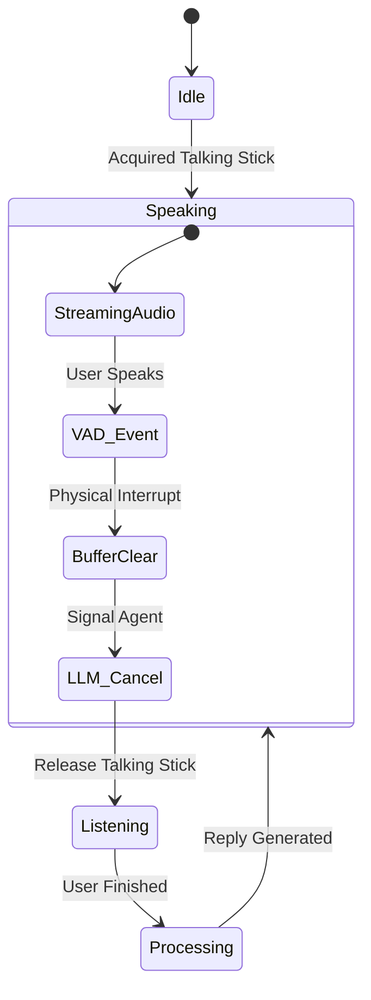

# Interruption Handling & State Transitions

Real-time interruption is a critical feature of the "Hybrid Agentic Swarm". It allows a human user (or another agent) to cut off the current speaker, triggering a "Cognitive Rewind" and a shift in conversation flow.

## The Dual-Layer Interruption Model

We handle interruptions on two levels:
1.  **Physical Interruption (The Ears):** Immediately stopping audio output.
2.  **Cognitive Interruption (The Brain):** Updating the agent's context to acknowledge the interruption.

## State Transition Diagram

## Detailed Flow

### 1. Host Speaking
*   **State:** The Host Agent is in the `Speaking` state.
*   **Action:** Streaming audio chunks via `LiveKitAdapter`.
*   **Status:** `_active_speakers = 0` (locally).

### 2. VAD Event (Physical Interruption)
*   **Trigger:** User starts speaking.
*   **Detection:** `silero.VAD` in `LiveKitAdapter` detects `START_OF_SPEECH`.
*   **Action:**
    *   `LiveKitAdapter` sets `_active_speakers = 1`.
    *   **Gating:** `send_audio_chunk` immediately drops all outgoing audio packets.
    *   **Signal:** `LiveRequestQueue.send_activity_start()` is called to notify the ADK runner.

### 3. Cognitive Rewind (System Signal)
*   **Trigger:** ADK Runner receives the activity start signal.
*   **Action:**
    *   The current LLM generation stream is cancelled.
    *   The `UniversalHostAgent` loop receives an event with `interrupted=True`.
    *   **Redis Update:** The agent publishes a `SYSTEM_SIGNAL` to `conversation_stream` with type `INTERRUPTION`.
    *   **Context Update:** The agent's internal context is rewound or updated to reflect that it was cut off.

### 4. Recovery
*   **Trigger:** User stops speaking (`END_OF_SPEECH`).
*   **Action:**
    *   `LiveKitAdapter` sets `_active_speakers = 0`.
    *   Agent enters `Listening` / `Processing` state to generate a response to the user's interjection.
